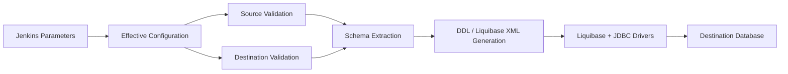

# Windows Migration Pipeline — Overview

## What This Is

The Windows Migration Pipeline is a Jenkins-driven database schema migration framework that extracts schema from a **source database**, generates **Liquibase DDL**, and applies it to a **destination database**. It supports three database types:

- MSSQL
- MySQL
- PostgreSQL

## Why It Exists

Cross-database migrations require:
1. Reliable schema extraction without manual scripting
2. Version-controlled, replayable DDL via Liquibase
3. Idempotent execution (safe to re-run)
4. Environment isolation (test artifacts never pollute production Liquibase directories)

## Scope

- **Platform:** Windows / Linux
- **Orchestrator:** Jenkins Declarative Pipeline
- **Business logic:** Shared Python modules (cross-platform)
- **Migration tool:** Liquibase 5.0.3
- **JDK:** Java 21

## High-Level Flow

## Key Guarantees

- Empty Jenkins parameters do **not** override database configuration defaults.
- Non-empty Jenkins parameters **do** override database configuration.
- Destination database is auto-created if missing (never dropped).
- Liquibase artifacts are isolated under `liquibase/migration/<database>/`.
- Source and destination can never resolve to the exact same endpoint.

## Document Index

| # | File | Topic |
|---|------|-------|
| 1 | `01_OVERVIEW.md` | This file |
| 2 | `02_ARCHITECTURE_AND_FLOW.md` | Architecture and parameter-flow diagrams |
| 3 | `03_JENKINS_PARAMETERS.md` | Jenkins pipeline parameters and meanings |
| 4 | `04_CONFIGURATION_AND_PARAMETER_RESOLUTION.md` | Config resolution, precedence, and defaults |
| 5 | `05_SOURCE_AND_DESTINATION_VALIDATION.md` | Validation logic and database auto-create |
| 6 | `06_SCHEMA_EXTRACTION.md` | Schema extraction and metadata output |
| 7 | `07_DDL_AND_LIQUIBASE_FLOW.md` | DDL generation and Liquibase execution |
| 8 | `08_STAGE_BY_STAGE_EXECUTION.md` | Detailed per-stage execution flow |
| 9 | `09_ACTUAL_MSSQL_TO_MYSQL_RUN.md` | Actual MSSQL → MySQL test run walkthrough |
| 10 | `10_FILE_BY_FILE_RESPONSIBILITY.md` | File responsibility matrix |
| 11 | `11_FAILURE_AND_TROUBLESHOOTING.md` | Failure points and troubleshooting |
| 12 | `12_HOW_TO_EXPLAIN_TO_OTHERS.md` | How to explain this to leadership |
| 13 | `13_FINAL_SUMMARY.md` | Final summary and key takeaways |
