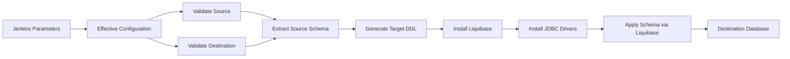
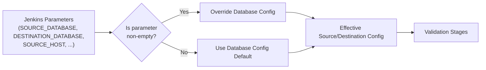

# Architecture and Flow

## What This Covers

This document describes the complete pipeline architecture, including:
- High-level migration flow
- Parameter-to-configuration resolution flow
- Platform layering
- Liquibase isolation

## High-Level Migration Flow



## Parameter to Configuration Flow



## Platform Layering

```
Jenkins Pipeline (migration/windows/Jenkinsfile)
        |
        v
Batch Wrappers (scripts/batch/migration/windows/*.bat)
        |
        v
Shared Python Modules (scripts/python/migration/*.py)
        |
        v
Configuration Layer (config/windows/migration/*.conf)
        |
        v
Liquibase + JDBC Drivers (tools/liquibase/, tools/drivers/)
        |
        v
Destination Database
```

### Layer Responsibilities

| Layer | Location | Platform Specific? |
|-------|----------|-------------------|
| Jenkins Pipeline | `migration/windows/Jenkinsfile` | Yes |
| Batch Wrappers | `scripts/batch/migration/windows/` | Yes |
| Python Orchestration | `scripts/python/migration/` | No (shared) |
| Configuration | `config/windows/migration/` | Yes |
| Liquibase Output | `liquibase/migration/<database>/` | No (shared) |
| Metadata Output | `metadata/<database>/` | No (shared) |

### Why Shared Python Modules?

The business migration logic (validation, extraction, DDL generation, Liquibase application) is identical across Windows and Linux. Only the OS-level wrappers differ. Centralizing logic in Python modules prevents platform-specific bugs from duplicating behavior.

## Liquibase Isolation

The pipeline enforces strict separation between production and migration Liquibase directories:

| Environment | Directory | Used For |
|-------------|-----------|----------|
| Production | `liquibase/mysql/`, `liquibase/mssql/`, `liquibase/postgresql/` | Production changelogs |
| Migration | `liquibase/migration/mysql/`, `liquibase/migration/mssql/`, `liquibase/migration/postgresql/` | Migration-generated changelogs |

This isolation prevents:
- Checksum mismatches between test and production changelogs
- Accidental modification of production DDL during migration testing

## Database Support Matrix

| Source | Destination | Supported |
|--------|-------------|-----------|
| MSSQL | MySQL | Yes |
| MSSQL | PostgreSQL | Yes |
| MSSQL | MSSQL | No (same-endpoint check blocks this) |
| MySQL | MSSQL | Yes |
| MySQL | MySQL | No |
| PostgreSQL | MSSQL | Yes |
| PostgreSQL | MySQL | Yes |
| PostgreSQL | PostgreSQL | No |

Same-database-type migration is blocked by the "not same endpoint" validation in `initialize.py`.

## Component Interaction Diagram

```mermaid
flowchart TB
    subgraph Jenkins["Jenkins Pipeline"]
        P1["Stage: Initialize Migration"]
        P2["Stage: Validate Source"]
        P3["Stage: Validate Destination"]
        P4["Stage: Extract Source Schema"]
        P5["Stage: Generate Target DDL"]
        P6["Stage: Install Liquibase"]
        P7["Stage: Install Drivers"]
        P8["Stage: Apply Schema"]
    end

    subgraph Config["Configuration Layer"]
        C1["source.conf"]
        C2["destination.conf"]
        C3["mssql.conf"]
        C4["mysql.conf"]
        C5["postgresql.conf"]
    end

    subgraph Python["Shared Python Modules"]
        PY1["initialize.py"]
        PY2["validate_source.py"]
        PY3["validate_destination.py"]
        PY4["extract_schema.py"]
        PY5["generate_ddl.py"]
        PY6["apply_schema.py"]
    end

    subgraph Output["Output Artifacts"]
        O1["metadata/<db>/schema_registry.json"]
        O2["metadata/<db>/cdc_status.json"]
        O3["liquibase/migration/<db>/*.xml"]
        O4["liquibase/migration/<db>/master.xml"]
    end

    P1 --> PY1
    P2 --> PY2
    P3 --> PY3
    P4 --> PY4
    P5 --> PY5
    P6 --> P7
    P7 --> P8

    PY1 --> C1 & C2 & C3 & C4 & C5
    PY2 --> C1 & C3 & C4 & C5
    PY3 --> C2 & C3 & C4 & C5

    PY4 --> O1 & O2
    PY5 --> O3 & O4
    PY6 --> O4

    P8 --> DEST_DB["Destination Database"]
```


