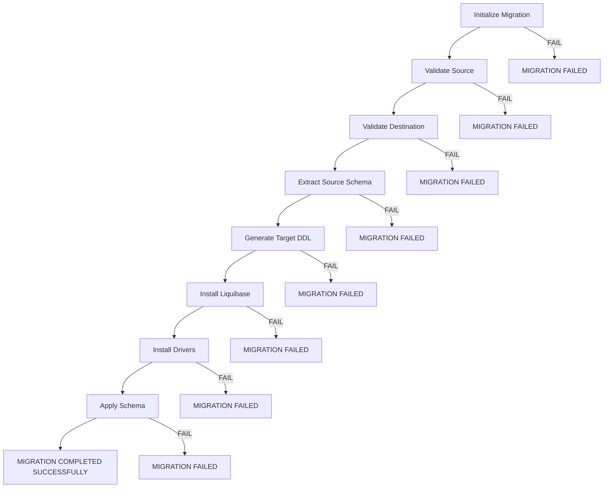

# Stage-by-Stage Execution Flow

## What This Covers

Detailed execution flow for each Jenkins pipeline stage, including what happens before, during, and after each stage.

## Complete Pipeline Execution Flow



## Stage 1: Initialize Migration

**Script:** `scripts\batch\migration\windows\initialize_migration.bat`
**Python:** `scripts\python\migration\initialize.py`

### Execution Steps

1. Set project root via `set_project_root.bat`
2. Set `PYTHONPATH` to project root
3. Execute `initialize.py`

### Python Logic

```python
source_defaults = load_migration_role_config("source")
dest_defaults = load_migration_role_config("destination")

db_defaults = {}
for db_name in ["mssql", "mysql", "postgresql"]:
    db_defaults.update(load_migration_config(db_name))

source_effective = build_effective_config(source_defaults, db_defaults, "SOURCE")
dest_effective = build_effective_config(dest_defaults, db_defaults, "DESTINATION")
```

### Validations Performed

| Validation | Failure Message |
|------------|----------------|
| Database type supported | `Unsupported DATABASE type: <type>` |
| Required fields present | `Missing required fields for <role>: <fields>` |
| Not same endpoint | `Source and destination resolve to the exact same database endpoint` |

### Output

Prints source and destination summary with masked passwords.

### Possible Outcomes

| Outcome | Meaning |
|---------|---------|
| `MIGRATION INITIALIZATION: PASS` | Config resolved successfully |
| `ERROR: Configuration file not found` | Config file missing |
| `ERROR: Migration initialization failed` | Unexpected error |

---

## Stage 2: Validate Source

**Script:** `scripts\batch\migration\windows\validate_source.bat`
**Python:** `scripts\python\migration\validate_source.py`

### Execution Steps

1. Set project root and PYTHONPATH
2. Execute `validate_source.py`

### Python Logic

1. Build effective source config (same resolution as Stage 1)
2. Add extra fields (e.g., `SOURCE_ODBC_DRIVER` for MSSQL)
3. Validate database type and required fields
4. Establish connection with `SELECT 1` test
5. Verify connected database matches configured database
6. Verify schema exists (if configured)

### Database Connection by Type

| Database | Connection Method |
|----------|-------------------|
| MSSQL | ODBC connection string with `DRIVER`, `SERVER`, `DATABASE`, `UID`, `PWD`, `Encrypt=no`, `TrustServerCertificate=yes` |
| MySQL | `mysql.connector.connect()` with host, port, user, password, database |
| PostgreSQL | `psycopg2.connect()` with host, port, user, password, database |

### Possible Outcomes

| Outcome | Meaning |
|---------|---------|
| `SOURCE VALIDATION: PASS` | Source reachable and schema valid |
| `ERROR: source validation failed: <error>` | Connection or validation error |

---

## Stage 3: Validate Destination

**Script:** `scripts\batch\migration\windows\validate_destination.bat`
**Python:** `scripts\python\migration\validate_destination.py`

### Execution Steps

1. Set project root and PYTHONPATH
2. Execute `validate_destination.py`

### Python Logic

1. Build effective destination config
2. Add extra fields (e.g., `DESTINATION_ODBC_DRIVER` for MSSQL)
3. Validate database type and required fields
4. Check if database exists:
   - **MySQL:** `SHOW DATABASES` (server-level connection)
   - **PostgreSQL:** Query `pg_database` from `postgres` database
   - **MSSQL:** Query `sys.databases` from `master` database
5. If missing, auto-create:
   - **MySQL:** `CREATE DATABASE \`<db>\`` + `conn.commit()`
   - **PostgreSQL:** `CREATE DATABASE "<db>"` with autocommit
   - **MSSQL:** `CREATE DATABASE [<db>]` with autocommit
6. Reconnect to the destination database
7. Verify connected database matches configured database
8. Verify schema exists (if configured)

### Possible Outcomes

| Outcome | Meaning |
|---------|---------|
| `DESTINATION VALIDATION: PASS` | Destination reachable and valid |
| `Database <name> does not exist` / `Creating database <name>...` / `Database created successfully` | Auto-created missing database |
| `ERROR: destination validation failed: <error>` | Connection or validation error |

---

## Stage 4: Extract Source Schema

**Script:** `scripts\batch\migration\windows\extract_schema.bat`
**Python:** `scripts\python\migration\extract_schema.py`
**Extractor:** `scripts\schema_extractor.py`

### Execution Steps

1. Set project root and PYTHONPATH
2. Execute `extract_schema.py`

### Python Logic

1. Build effective source config
2. Build effective destination config (to determine target metadata directory)
3. Backup `source.conf`
4. Write effective source config to `source.conf` (with `SOURCE_DB_TYPE=<type>`)
5. Execute `schema_extractor.py <dest_db_type>` as subprocess
6. Restore original `source.conf`
7. Read and print summary from `schema_registry.json` and `cdc_status.json`

### Schema Extractor Logic

1. Read `source.conf` for `SOURCE_DB_TYPE` and connection fields
2. Connect to source database
3. Discover tables using `information_schema.TABLES`
4. For each table, discover columns using `information_schema.COLUMNS` ordered by `ORDINAL_POSITION`
5. Normalize table names (lowercase, spaces to underscores)
6. Compare against existing `schema_registry.json` for CDC status
7. Write updated registry and CDC status

### Output Files

| File | Location | Content |
|------|----------|---------|
| `schema_registry.json` | `metadata/<database>/schema_registry.json` | Table → column list mapping |
| `cdc_status.json` | `metadata/<database>/cdc_status.json` | CDC status per table |

### Possible Outcomes

| Outcome | Meaning |
|---------|---------|
| `EXTRACT SOURCE SCHEMA: PASS` | Extraction successful |
| `ERROR: Schema extractor not found` | `schema_extractor.py` missing |
| `ERROR: Schema extraction failed` | Connection or extraction error |

---

## Stage 5: Generate Target DDL

**Script:** `scripts\batch\migration\windows\generate_ddl.bat`
**Python:** `scripts\python\migration\generate_ddl.py`

### Execution Steps

1. Set project root and PYTHONPATH
2. Execute `generate_ddl.py`

### Python Logic

1. Resolve destination database type
2. Read `metadata/<database>/schema_registry.json`
3. Scan existing `liquibase/migration/<database>/*.xml` for covered tables/columns
4. For each table with new columns:
   - If table is new: generate `createTable` changeset
   - If table exists but has new columns: generate `addColumn` changeset
5. Update `master.xml` with all generated files
6. Ensure `master_objects.xml` exists (empty placeholder if missing)
7. Write `schema_status.json`

### Output Files

| File | Location | Content |
|------|----------|---------|
| `NNN_create_<table>.xml` | `liquibase/migration/<database>/` | New table creation changeset |
| `NNN_alter_<table>_add_columns.xml` | `liquibase/migration/<database>/` | Column addition changeset |
| `master.xml` | `liquibase/migration/<database>/master.xml` | Updated changelog index |
| `master_objects.xml` | `liquibase/migration/<database>/master_objects.xml` | Empty placeholder |
| `schema_status.json` | `metadata/<database>/schema_status.json` | `{"schema_changed": true/false}` |

### Possible Outcomes

| Outcome | Meaning |
|---------|---------|
| `GENERATE TARGET DDL: PASS` | DDL generated successfully |
| `No schema changes detected. Nothing to generate.` | No new tables or columns |
| `ERROR: Schema registry not found` | Extraction did not run or wrote to wrong path |
| `ERROR: DDL generation failed` | Unexpected error |

---

## Stage 6: Install Liquibase

**Script:** `scripts\batch\common\install_liquibase.bat`

### Execution Steps

1. Execute PowerShell script to download Liquibase
2. Verify `tools/liquibase/liquibase.bat` exists

### Possible Outcomes

| Outcome | Meaning |
|---------|---------|
| `LIQUIBASE INSTALLATION SUCCESSFUL` | Liquibase ready |
| `Liquibase already exists.` | Already present, no action needed |
| `ERROR: LIQUIBASE INSTALLATION FAILED` | Download or extraction failed |

---

## Stage 7: Install Drivers

**Scripts:** Three separate `bat` files run sequentially

| Script | Driver | Expected File |
|--------|--------|---------------|
| `scripts\batch\common\install_mssql_driver.bat` | MSSQL JDBC | `tools/drivers/mssql-jdbc-<version>.jre11.jar` |
| `scripts\batch\mysql\setup\install_mysql_driver.bat` | MySQL Connector/J | `tools/drivers/mysql-connector-j-<version>.jar` |
| `scripts\batch\postgresql\setup\install_postgresql_driver.bat` | PostgreSQL JDBC | `tools/drivers/postgresql-<version>.jar` |

Each script downloads the driver via PowerShell if not already present.

### Possible Outcomes

| Outcome | Meaning |
|---------|---------|
| `... DRIVER INSTALLATION SUCCESSFUL` | Driver ready |
| `... Driver already exists.` | Already present, no action needed |
| `ERROR: ... DRIVER INSTALLATION FAILED` | Download or extraction failed |

---

## Stage 8: Apply Schema

**Script:** `scripts\batch\migration\windows\apply_schema.bat`
**Python:** `scripts\python\migration\apply_schema.py`
**Runner:** `scripts\batch\migration\windows\run_liquibase.bat`

### Execution Steps

1. Set project root and PYTHONPATH
2. Execute `apply_schema.py`
3. `apply_schema.py` calls `run_liquibase.bat` with:
   - Database type
   - Changelog path
   - Command (`update`)
   - Connection parameters (host, port, db, user, password)

### run_liquibase.bat Logic

1. Read migration config for destination database type
2. Override with explicit arguments if provided
3. Validate required config (HOST, PORT, DB, USER, DRIVER_VERSION)
4. Validate Liquibase version
5. Validate JDBC driver file exists
6. Construct JDBC URL and driver class
7. Execute Liquibase `update` command

### Liquibase Output

```
Run:                          3
Previously run:               0
Filtered out:                 0
-------------------------------
Total change sets:            3

Running Changeset: liquibase/migration/mysql/001_create_customers.xml::001::tanisha
Running Changeset: liquibase/migration/mysql/002_create_orders.xml::002::tanisha
Running Changeset: liquibase/migration/mysql/003_create_products.xml::003::tanisha
Liquibase: Update has been successful. Rows affected: 0
Liquibase command 'update' was executed successfully.
```

### Possible Outcomes

| Outcome | Meaning |
|---------|---------|
| `APPLY SCHEMA: PASS` | Liquibase update succeeded |
| `ERROR: Liquibase update failed` | Liquibase execution error |
| `ERROR: <db> LIQUIBASE <command> FAILED` | Non-zero exit from Liquibase |

---

## Post Actions

On success:
```
MIGRATION COMPLETED
MIGRATION COMPLETED SUCCESSFULLY
```

On failure:
```
MIGRATION FAILED
```

On always:
```
MIGRATION COMPLETED
```

## Stage Timing

All stages run sequentially. `disableConcurrentBuilds()` is set in the Jenkinsfile, so only one pipeline execution runs at a time per job.
