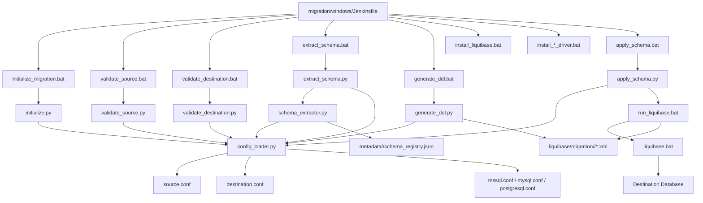

# File-by-File Responsibility

## What This Covers

A complete matrix of every file involved in the migration pipeline, what it does, and who calls it.

## Jenkins Pipeline

| File | Responsibility |
|------|---------------|
| `migration/windows/Jenkinsfile` | Defines pipeline parameters and 8 stages. Entry point for Windows migration. |

## Python Migration Modules (Shared)

| File | Responsibility |
|------|---------------|
| `scripts/python/migration/initialize.py` | Resolves effective source/destination config, validates types and fields, prevents same-endpoint migration |
| `scripts/python/migration/validate_source.py` | Tests source connection, verifies database and schema |
| `scripts/python/migration/validate_destination.py` | Tests destination connection, auto-creates missing database, verifies database and schema |
| `scripts/python/migration/extract_schema.py` | Orchestrates schema extraction: writes temp source.conf, invokes schema_extractor.py, reads and prints metadata summary |
| `scripts/python/migration/generate_ddl.py` | Reads schema_registry.json, generates Liquibase XML changelogs, updates master.xml |
| `scripts/python/migration/apply_schema.py` | Invokes Liquibase runner with destination connection parameters |

## Schema Extractor

| File | Responsibility |
|------|---------------|
| `scripts/schema_extractor.py` | Connects to source database, discovers tables and columns, writes schema_registry.json and cdc_status.json |

## Configuration Loader

| File | Responsibility |
|------|---------------|
| `scripts/python/common/config_loader.py` | Resolves platform-specific config paths, loads key=value config files |

## Windows Batch Wrappers

| File | Responsibility | Calls |
|------|---------------|-------|
| `scripts/batch/migration/windows/initialize_migration.bat` | Initializes migration | `initialize.py` |
| `scripts/batch/migration/windows/validate_source.bat` | Validates source | `validate_source.py` |
| `scripts/batch/migration/windows/validate_destination.bat` | Validates destination | `validate_destination.py` |
| `scripts/batch/migration/windows/extract_schema.bat` | Extracts schema | `extract_schema.py` |
| `scripts/batch/migration/windows/generate_ddl.bat` | Generates DDL | `generate_ddl.py` |
| `scripts/batch/migration/windows/apply_schema.bat` | Applies schema | `apply_schema.py` |
| `scripts/batch/migration/windows/run_liquibase.bat` | Executes Liquibase | `liquibase.bat` |
| `scripts/batch/common/set_project_root.bat` | Sets PROJECT_ROOT environment variable | Called by all migration batch files |
| `scripts/batch/common/install_liquibase.bat` | Downloads Liquibase if missing | PowerShell download script |
| `scripts/batch/common/install_mssql_driver.bat` | Downloads MSSQL JDBC driver if missing | PowerShell download script |
| `scripts/batch/mysql/setup/install_mysql_driver.bat` | Downloads MySQL Connector/J if missing | PowerShell download script |
| `scripts/batch/postgresql/setup/install_postgresql_driver.bat` | Downloads PostgreSQL JDBC driver if missing | PowerShell download script |
| `scripts/batch/common/validate_liquibase.bat` | Validates Liquibase version | Called by `run_liquibase.bat` |

## Configuration Files

| File | Responsibility |
|------|---------------|
| `config/windows/migration/source.conf` | Source role defaults: `SOURCE_DATABASE`, `SOURCE_SCHEMA` |
| `config/windows/migration/destination.conf` | Destination role defaults: `DESTINATION_DATABASE`, `DESTINATION_SCHEMA` |
| `config/windows/migration/mssql.conf` | MSSQL connection defaults and driver version |
| `config/windows/migration/mysql.conf` | MySQL connection defaults and driver version |
| `config/windows/migration/postgresql.conf` | PostgreSQL connection defaults and driver version |

## Liquibase Output

| File/Directory | Responsibility |
|----------------|---------------|
| `liquibase/migration/mysql/master.xml` | MySQL migration changelog index |
| `liquibase/migration/mysql/master_objects.xml` | Empty placeholder for object tracking |
| `liquibase/migration/mysql/*.xml` | Per-table/per-change Liquibase changesets |
| `liquibase/migration/mssql/master.xml` | MSSQL migration changelog index |
| `liquibase/migration/postgresql/master.xml` | PostgreSQL migration changelog index |

## Metadata Output

| File | Responsibility |
|------|---------------|
| `metadata/mysql/schema_registry.json` | Extracted MySQL table→column mapping |
| `metadata/mysql/cdc_status.json` | CDC status for MySQL extraction |
| `metadata/mysql/schema_status.json` | Whether schema changed during generation |
| `metadata/mssql/schema_registry.json` | Extracted MSSQL table→column mapping |
| `metadata/postgresql/schema_registry.json` | Extracted PostgreSQL table→column mapping |

## Tools

| File/Directory | Responsibility |
|----------------|---------------|
| `tools/liquibase/liquibase.bat` | Liquibase executable |
| `tools/drivers/mssql-jdbc-<version>.jre11.jar` | MSSQL JDBC driver |
| `tools/drivers/mysql-connector-j-<version>.jar` | MySQL JDBC driver |
| `tools/drivers/postgresql-<version>.jar` | PostgreSQL JDBC driver |

## PowerShell Download Scripts

| File | Responsibility |
|------|---------------|
| `scripts/powershell/download_liquibase.ps1` | Downloads Liquibase |
| `scripts/powershell/download_mssql_driver.ps1` | Downloads MSSQL JDBC driver |
| `scripts/powershell/mysql/download_mysql_driver.ps1` | Downloads MySQL Connector/J |
| `scripts/powershell/postgresql/download_postgresql_driver.ps1` | Downloads PostgreSQL JDBC driver |

## Call Graph

