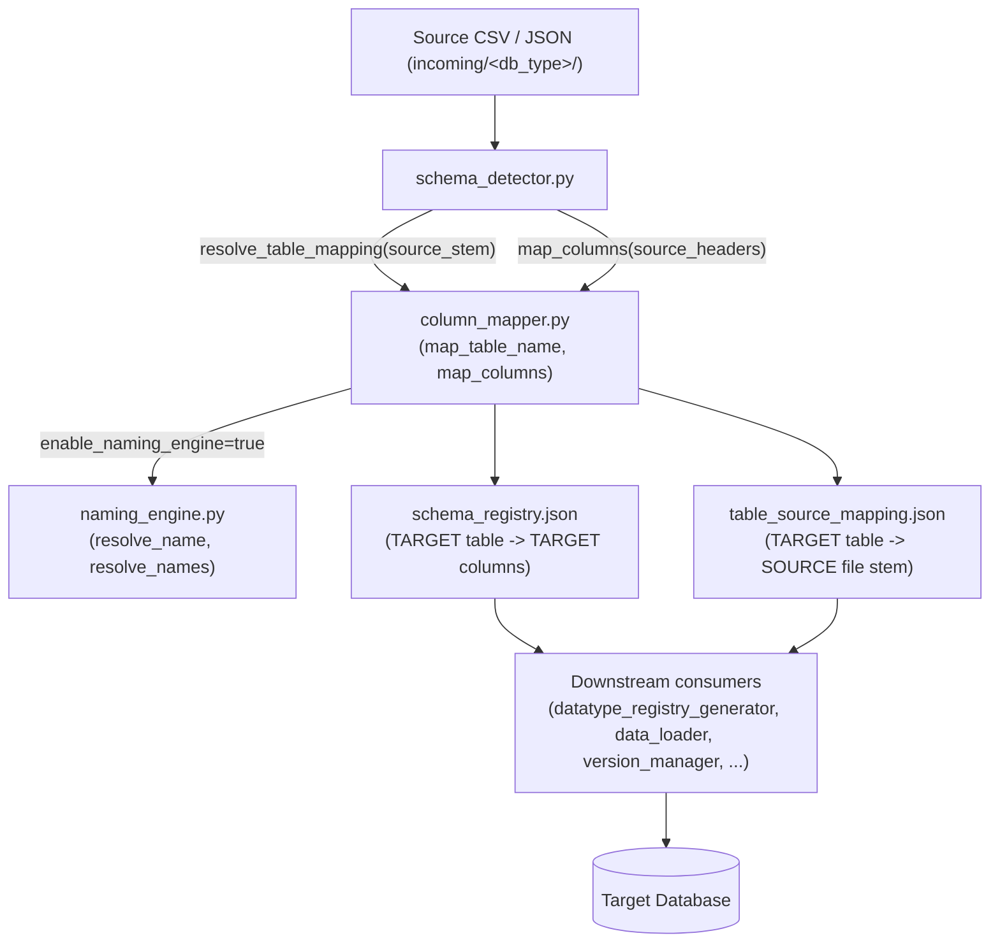
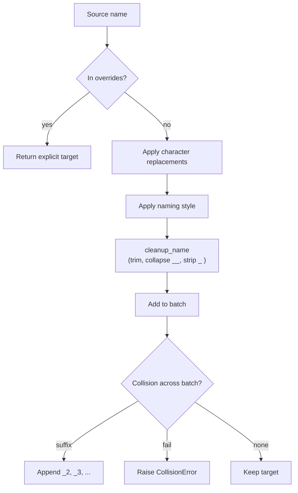

# Column and Table Name Override

> Documentation set: `runtime_schema_overrides_20260831`
> Branch: `column-name-override`
> Scope of this document: column-name and table-name override only (datatype override is covered separately).

This document describes how the pipeline converts **SOURCE** schema names (as they appear in incoming
CSV/JSON files) into standardized **TARGET** schema names (as stored in metadata and consumed downstream),
and how the original source files are tracked so they can be located later.

All behaviour described here is verified against the implementation on the current branch. Source-of-truth
files:

- `config/column_mapping.json`
- `config/common/naming_rules.json`
- `scripts/python/common/column_mapper.py`
- `scripts/python/common/naming_engine.py`
- `scripts/schema_detector.py`
- `scripts/datatype_registry_generator.py`
- `scripts/data_loader.py`
- `tests/test_naming_engine.py`
- `tests/test_schema_naming_integration.py`

---

## 1. Purpose

Source files are generated or exported by upstream systems and frequently contain names that are not
valid or desirable as database identifiers:

- Source **file/table** names may contain spaces (`Customer Records`) or special characters
  (`Sales-Data`, `Order.Details`).
- Source **column** names may be mixed-case or concatenated (`CustomerID`, `FirstName`, `LastName`)
  and do not match the project's desired database naming convention.
- The target database schema must use a consistent, predictable naming standard (snake_case by default).
- The **source files themselves must remain unchanged** — the renaming happens only in the
  metadata/schema representation, never on disk.

The override feature solves this by providing:

1. A deterministic mapping from any source name to a clean target name.
2. A way to pin specific names via explicit overrides.
3. A generic, configuration-driven engine so that new names are handled automatically without code changes.
4. A metadata link (target → source) so downstream stages (datatype detection, validation, data load)
   can still find the original file.

---

## 2. Scope

**In scope**

| Capability | Where |
|---|---|
| Table-name mapping (source stem → target table) | `column_mapper.map_table_name` / `resolve_table_mapping` |
| Column-name mapping (source header → target column) | `column_mapper.map_columns` |
| Generic naming engine (style + replacement + cleanup) | `naming_engine.py` |
| Naming styles (snake_case, camelCase, PascalCase, kebab-case, lowercase, UPPERCASE, preserve) | `naming_engine.apply_naming_style` |
| Configuration-driven character replacement | `naming_engine.apply_character_replacements` |
| Explicit overrides (table + column) | `column_mapper` / `naming_engine` overrides |
| Collision handling (suffix / fail) | `naming_engine.resolve_collisions` |
| Source → target metadata tracking | `schema_detector.update_table_source_mapping` + `column_mapper.resolve_source_file_stem` |

**Out of scope (NOT done by this feature)**

- Datatype inference or datatype override (separate document).
- Renaming or moving the source file on disk.
- Database-specific identifier quoting or escaping (the engine is database-neutral; see §16).
- Schema *content* validation (the mapped names only; value validation is a different stage).
- Automatic discovery of new mapping rules — rules are supplied via JSON config.

---

## 3. High-Level Architecture



Notes on the actual flow (`scripts/schema_detector.py`):

- `main()` scans `incoming/<db_type>/*.csv` and `*.json`.
- For each file it computes `source_table_name = file.stem.strip()` and then
  `target_table_name = resolve_table_mapping(source_table_name, mapping_config)`.
- It reads the headers/keys, then `target_headers = map_columns(headers, mapping_config, source_table_name)`.
- It writes the result into `metadata/<db_type>/schema_registry.json`
  (`update_schema_registry`) and `metadata/<db_type>/table_source_mapping.json`
  (`update_table_source_mapping`).

---

## 4. Configuration Files

There are **two** configuration files. They are independent switches:

- `config/column_mapping.json` → `settings.enable_mapping` (legacy/manual path).
- `config/common/naming_rules.json` → `settings.enable_naming_engine` (generic engine path).

When `enable_naming_engine` is `true`, `column_mapper` delegates table/column resolution entirely to
`naming_engine` and ignores the legacy `table_mapping` / `manual` maps for the transformation logic.

### 4.1 `config/column_mapping.json`

```json
{
  "settings": {
    "enable_mapping": true
  },
  "table_mapping": {
    "Customer Records": "customers",
    "Supplier Master": "suppliers"
  },
  "manual": {
    "CustomerID": "customer_id",
    "FirstName": "first_name",
    "LastName": "last_name",
    "EmailAddr": "email",
    "Phone": "phone",
    "SupplierCode": "supplier_id",
    "SupplierName": "supplier_name",
    "ContactEmail": "email",
    "ContactPhone": "phone",
    "City": "city"
  },
  "dictionary": {},
  "ignore_columns": []
}
```

| Key | Meaning |
|---|---|
| `settings.enable_mapping` | Master switch for the legacy mapping path. |
| `table_mapping` | Explicit **SOURCE table name → TARGET table name** overrides. |
| `manual` | Explicit **SOURCE column header → TARGET column name** overrides. |
| `dictionary` | Substring/word-level replacements applied to unmatched column names (empty by default). |
| `ignore_columns` | Column headers to drop entirely (matched case-insensitively; empty by default). |

Additional legacy behaviour (in `normalize_name`, used only when the engine is disabled):

- leading/trailing whitespace is trimmed;
- `replace` entries from settings are applied (when configured);
- names are lowercased and camelCase is optionally split;
- duplicate / leading / trailing underscores are collapsed.

> The naming/mapping implementation supports configurable `replace` settings during normalization.
> However, the current `config/column_mapping.json` does **not** define a `replace` block; the
> currently configured character replacement rules are in `config/common/naming_rules.json`.

**Disabled behaviour** — when `enable_mapping = false`:

- `map_table_name` returns `source_name.strip().lower().replace(" ", "_")`
  (a minimal sanitize, no `table_mapping` lookup).
- `map_columns` returns the source headers unchanged (after `.strip()`), minus
  `ignore_columns`. No `manual`/`dictionary`/`replace` is applied.
- `get_source_to_target_mapping` returns an identity `source → source` mapping.
- `resolve_source_file_stem` returns the target table name unchanged (no lookup),
  because the mapping metadata is considered inactive.

### 4.2 `config/common/naming_rules.json`

```json
{
  "version": "1.0",
  "description": "Generic naming rules for tables and columns",
  "settings": {
    "enable_naming_engine": false
  },
  "table": {
    "style": "snake_case",
    "character_replacements": {
      " ": "_",
      "-": "_",
      ".": "_",
      "@": "_",
      "#": "_",
      "*": ""
    },
    "overrides": {
      "Customer Records": "customers",
      "Supplier Master": "suppliers"
    }
  },
  "column": {
    "style": "snake_case",
    "character_replacements": {
      " ": "_",
      "-": "_",
      ".": "_",
      "@": "_",
      "#": "_",
      "*": ""
    },
    "overrides": {
      "CustomerID": "customer_id",
      "FirstName": "first_name",
      "LastName": "last_name",
      "EmailAddr": "email",
      "Phone": "phone",
      "SupplierCode": "supplier_id",
      "SupplierName": "supplier_name",
      "ContactEmail": "email",
      "ContactPhone": "phone",
      "City": "city"
    }
  },
  "collision": {
    "strategy": "suffix",
    "separator": "_",
    "start_index": 2
  }
}
```

| Key | Meaning |
|---|---|
| `settings.enable_naming_engine` | Master switch for the generic engine path. **Currently `false`** in the repo, so the legacy `column_mapping.json` path is active by default. |
| `table.style` / `column.style` | Naming style to apply (see §5). |
| `table.character_replacements` / `column.character_replacements` | Character → replacement map, applied before styling (see §6). |
| `table.overrides` / `column.overrides` | Explicit **SOURCE → TARGET** overrides; highest precedence (see §7). |
| `collision.strategy` | `suffix` or `fail`. |
| `collision.separator` | Separator used for suffix numbering (default `_`). |
| `collision.start_index` | First suffix number (default `2`, giving `_2`, `_3`, ...). |

---

## 5. Naming Styles

The generic engine supports the following styles (`naming_engine.apply_naming_style`). For the
multi-word examples the source string `Customer Name` is used.

| Style | Input | Output |
|---|---|---|
| `snake_case` | `Customer Name` | `customer_name` |
| `camelCase` | `Customer Name` | `customerName` |
| `PascalCase` | `Customer Name` | `CustomerName` |
| `kebab-case` | `Customer Name` | `customer-name` |
| `lowercase` | `Customer Name` | `customer name` |
| `UPPERCASE` | `Customer Name` | `CUSTOMER NAME` |
| `preserve` | `Customer Name` | `Customer Name` |

Internal mechanics (verified by `tests/test_naming_engine.py`):

- `preserve` returns the input unchanged.
- `lowercase` / `UPPERCASE` are simple case transforms.
- For `snake_case`, `kebab-case`, `camelCase`, `PascalCase`, the engine first inserts `_` at
  case boundaries and at `-\s\.` runs, then:
  - `snake_case` → lowercased.
  - `kebab-case` → lowercased with `_` → `-`.
  - `camelCase` → first part lowercased, remaining parts capitalized.
  - `PascalCase` → all parts capitalized.
- An unsupported style raises `ValueError`.

---

## 6. Character Replacement

Replacements are **configuration-driven** and applied before the naming style. The engine iterates over
the configured replacement map and performs a literal `str.replace` for each entry
(`naming_engine.apply_character_replacements`):

```python
result = name
for old, new in replacements.items():
    result = result.replace(old, new)
```

Default configuration (`naming_rules.json`):

| Source char | Replacement |
|---|---|
| ` ` (space) | `_` |
| `-` | `_` |
| `.` | `_` |
| `@` | `_` |
| `#` | `_` |
| `*` | `` (deleted) |

**Order:** replacements are applied in the order they appear in the JSON object (Python preserves
insertion order). In the default config the order is space → `-` → `.` → `@` → `#` → `*`. Because
`*` maps to empty string, it is typically placed last so earlier replacements are not affected.

**No code change required:** adding a new replacement (e.g. `"$": "_"`) is purely a JSON edit. This is
explicitly verified by `test_dynamic_replacement_no_code_change` in
`tests/test_schema_naming_integration.py`, which adds `"$": "_"` and confirms `Customer$ID` →
`customer_id` without touching Python.

---

## 7. Override Precedence

For a single name, the generic engine (`naming_engine.resolve_name`) applies the following precedence:

1. **Explicit override** — if the source name (or its lowercase form) is a key in `overrides`,
   the configured target is returned immediately.
2. **Character replacements** — configured replacements are applied.
3. **Naming style** — the style transform is applied.
4. **Generic cleanup / normalization** — `cleanup_name` strips whitespace, collapses repeated
   underscores, and trims leading/trailing underscores (raises `ValueError` if the result is empty).
5. **Collision handling** — applied across the *batch* of names (see §13); not per single name.



The legacy path (`enable_mapping = true`, engine off) uses equivalent precedence:
`manual` override → `dictionary` substring → `replace` chars → `normalize_name`.

---

## 8. Table Name Override

**Source file:** `Customer Records.csv`
**Target table:** `customers`

Configuration (either file):

- Legacy: `column_mapping.json` → `table_mapping["Customer Records"] = "customers"`.
- Engine: `naming_rules.json` → `table.overrides["Customer Records"] = "customers"`.

Code path:

1. `schema_detector.main` reads `source_table_name = csv_file.stem.strip()` → `"Customer Records"`.
2. Calls `resolve_table_mapping(source_table_name, mapping_config)` → `map_table_name`.
3. With the engine enabled, `map_table_name` calls `_map_table_name_with_engine` →
   `naming_engine.resolve_name("Customer Records", style, replacements, overrides)`.
   The override matches, so `"customers"` is returned without any further transformation.
4. `target_table_name = "customers"` is then used for `schema_registry.json` and
   `table_source_mapping.json`.

> Note: `map_table_name` does **not** depend on `map_columns` — table and column mapping are independent.

---

## 9. Column Name Override

**Source headers** (as they appear in the CSV):

```
CustomerID, FirstName, LastName
```

**Target columns** (as stored in `schema_registry.json` and used downstream):

```
customer_id, first_name, last_name
```

Configuration (either file):

- Legacy: `column_mapping.json` → `manual` map.
- Engine: `naming_rules.json` → `column.overrides`.

`map_columns` maps each source header to a target column name and returns the **list of target names**
in order. `get_source_to_target_mapping` returns the **dict** `{source: target}` (used by the data
loader and datatype generator to translate between file headers and target columns). Ignored columns
(`ignore_columns`) are omitted.

---

## 10. Source File Integrity

The source file is **never renamed or moved**. Only the schema/metadata representation is transformed.

```
Customer Records.csv          (stays in incoming/&lt;db_type&gt;/)
        |
        |  map_table_name / resolve_table_mapping
        v
target table: customers
```

`table_source_mapping.json` stores the **TARGET → SOURCE** relationship so that any later stage that
needs the original file can resolve it:

```json
{
  "customers": "Customer Records"
}
```

This is written by `schema_detector.update_table_source_mapping(target_table, source_file_stem, ...)`
and read back by `column_mapper.resolve_source_file_stem(target_table_name, config, db_type)`.

Verified by `test_source_file_not_renamed` (the source `.csv` still exists after detection and the
mapping points back to `"Customer Records"`).

---

## 11. `schema_registry.json` Flow

`metadata/<db_type>/schema_registry.json` stores **TARGET** table names and **TARGET** column names
only. It never contains source names.

```json
{
  "customers": [
    "customer_id",
    "first_name",
    "last_name"
  ]
}
```

Written by `schema_detector.update_schema_registry`. Because it holds target names, every downstream
consumer (e.g. Liquibase changelog generation, DDL generation, version management, object generation)
operates on the canonical target schema without needing to know the original source headers.

The registry also de-duplicates columns case-insensitively and supports incremental updates
(`detect_schema_changes` reports `NEW` / `CHANGED` / `DELETED` / `UNCHANGED` into `cdc_status.json`).

---

## 12. `table_source_mapping.json` Flow

`metadata/<db_type>/table_source_mapping.json` maps **TARGET table → ORIGINAL source file stem**.

```json
{
  "customers": "Customer Records"
}
```

It is required by stages that must read the **original** source file:

- **Datatype detection** (`scripts/datatype_registry_generator.py`):
  `resolve_source_file_stem(table, mapping_config, db_type)` returns the source stem, then the
  generator opens `incoming/<db_type>/<source_stem>.csv` to sample values.
  It then uses `get_source_to_target_mapping(file_columns, ...)` to translate sampled source columns
  into the target columns recorded in the schema registry.
- **Data loading** (`scripts/data_loader.py`): resolves the target table name from the file stem and
  builds a `source → target` mapping so incoming rows are inserted under target column names.
- **Validation**: needs the original file to validate against.

Only dependencies that are actually present in the code are listed above.

---

## 13. Collision Handling

When two or more distinct source names resolve to the same target name, `naming_engine.resolve_collisions`
prevents silent data loss.

### suffix

With `strategy: "suffix"`, `separator: "_"`, `start_index: 2`:

```
customer_id      (first occurrence)
customer_id_2    (second)
customer_id_3    (third)
```

This is verified by `test_collision_suffix_in_schema_flow`:
`["Customer-ID", "Customer_ID", "Customer ID"]` → `["customer_id", "customer_id_2", "customer_id_3"]`.

### fail

With `strategy: "fail"`, a `CollisionError` is raised instead of overwriting:

```python
raise CollisionError(
    f"Collision detected: source names {sources} "
    f"both map to target '{target_name}' (strategy: fail)"
)
```

Verified by `test_collision_fail_in_schema_flow`, which expects `CollisionError` for
`["Customer-ID", "Customer_ID"]`.

**Why this matters:** without collision handling, two source columns would silently collapse into one
target column, losing one source column's data. The `fail` strategy makes the conflict explicit; the
`suffix` strategy preserves all columns with unique, deterministic names.

The legacy `enable_mapping` path also detects collisions and raises `ValueError`
("Column mapping collision: ...") when two source columns map to the same target.

---

## 14. Mapping Disabled / Backward Compatibility

| Switch | Value | Effect |
|---|---|---|
| `enable_mapping` (`column_mapping.json`) | `false` | `map_table_name` → minimal sanitize (`lower()` + spaces→`_`); `map_columns` → source headers unchanged (minus `ignore_columns`); `get_source_to_target_mapping` → identity; `resolve_source_file_stem` → returns target name (no lookup). |
| `enable_naming_engine` (`naming_rules.json`) | `false` | `column_mapper` ignores the engine and uses the legacy `column_mapping.json` path. |

In the repository today `enable_naming_engine` is `false`, so the legacy behaviour is the active default.
Both switches can be combined: the engine is only consulted when `enable_naming_engine = true`.

Backward compatibility is explicitly asserted by:

- `test_engine_disabled_by_default` — confirms `enable_naming_engine` defaults to `false`.
- `test_existing_column_mapping_behavior_preserved` — with `enable_mapping = true`,
  `map_table_name("Customer Records")` → `"customers"` and
  `map_columns(["CustomerID","FirstName","LastName"])` → `["customer_id","first_name","last_name"]`.
- `test_naming_disabled_preserves_existing_behavior` (integration) — `employees.csv` with
  already-clean names passes through unchanged and `table_source_mapping["employees"] == "employees"`.

---

## 15. Complete Runtime Flow

```mermaid
sequenceDiagram
    participant F as Source file (incoming/&lt;db&gt;/X.csv)
    participant D as schema_detector.py
    participant C as column_mapper.py
    participant N as naming_engine.py
    participant R as schema_registry.json
    participant M as table_source_mapping.json
    participant O as Downstream (datatype/loader/...)

    F->>D: file found, stem = "X" (SOURCE)
    D->>C: resolve_table_mapping("X")
    C->>N: resolve_name (if engine on)
    N-->>C: target table "x" (TARGET)
    C-->>D: target_table_name
    D->>F: read headers (SOURCE)
    D->>C: map_columns(headers)
    C->>N: resolve_names (if engine on)
    N-->>C: target_headers (TARGET)
    C-->>D: target_headers
    D->>R: update_schema_registry(target, target_headers)
    D->>M: update_table_source_mapping(target, "X")
    O->>M: resolve_source_file_stem(target) -> "X"
    O->>F: open incoming/&lt;db&gt;/X.csv (original SOURCE)
    O->>R: read target schema (TARGET)
```

All SOURCE names originate from the file stem / headers; all TARGET names are produced by the mapper
and persisted in `schema_registry.json`. The `table_source_mapping.json` link is what lets downstream
stages recover the SOURCE file from a TARGET table name.

---

## 16. Database Independence

The name-override logic is **database-neutral**:

- `naming_engine.py` contains no database-specific code; it transforms strings only.
- `column_mapper.py` is pure string mapping; it does not emit SQL or quote identifiers.
- The only place `<db_type>` appears is (a) `schema_detector.main` selecting the
  `incoming/<db_type>` / `metadata/<db_type>` folders, and (b)
  `resolve_source_file_stem` selecting the `metadata/<db_type>/table_source_mapping.json` file to read.

The resulting target names are therefore reusable across MongoDB, PostgreSQL, MySQL, and MSSQL consumers
without alteration. No database-specific identifier behaviour is claimed because none exists in the code.

---

## 17. Testing

Two dedicated test suites cover this feature.

### `tests/test_naming_engine.py` (engine unit tests)

- Style tests for `snake_case`, `camelCase`, `PascalCase`, `kebab-case`, `lowercase`, `UPPERCASE`,
  `preserve` (10 parametrized cases each), plus `test_unsupported_style`.
- Character-replacement tests: space, hyphen, dot, at, hash, star(deleted), multiple, dynamic `$`,
  and empty-dict.
- Override tests: explicit override wins over style, over replacement, case-insensitive override,
  no-override falls back to style.
- Collision tests: `suffix`, `fail`, override-collision `suffix`, override-collision `fail`, no-collision.
- Edge cases: empty input, cleanup-empty error, leading digit, whitespace, repeated separators,
  special chars, invalid strategy.
- Backward-compat: `test_engine_disabled_by_default`,
  `test_existing_column_mapping_behavior_preserved`.

### `tests/test_schema_naming_integration.py` (end-to-end)

- `test_naming_disabled_preserves_existing_behavior` — disabled mode keeps clean names, mapping is identity.
- `test_table_override` — `Customer Records.csv` → `customers` table,
  `[customer_id, first_name, last_name]`, mapping `"customers": "Customer Records"`.
- `test_generic_naming_snake_case` — `Sales-Data.csv` with `Order ID`, `Customer-ID`, `Order.Amount`
  → `sales_data` table, `[order_id, customer_id, order_amount]`.
- `test_naming_styles_via_column_mapper` — all 7 styles via the full `column_mapper` entry point.
- `test_dynamic_replacement_no_code_change` — `$` added in JSON only → `customer_id`.
- `test_override_precedence_over_style` — override beats style.
- `test_collision_suffix_in_schema_flow` / `test_collision_fail_in_schema_flow`.
- `test_source_file_not_renamed` — source file remains on disk; mapping points back to source stem.

These tests pass against the current branch (they are part of the completed implementation).

---

## 18. Example End-to-End Scenario

**Source file:** `incoming/mysql/Customer Records.csv`

**Source columns:** `CustomerID`, `FirstName`, `LastName`

**Step 1 — table name**

```
"Customer Records"  --(table.overrides)-->  "customers"
```

**Step 2 — column names** (engine on, style `snake_case`)

```
CustomerID   --(column.overrides)-->  customer_id
FirstName     --(column.overrides)-->  first_name
LastName      --(column.overrides)-->  last_name
```

**Step 3 — persisted metadata**

`metadata/mysql/schema_registry.json`

```json
{
  "customers": ["customer_id", "first_name", "last_name"]
}
```

`metadata/mysql/table_source_mapping.json`

```json
{
  "customers": "Customer Records"
}
```

**Step 4 — downstream**

- Datatype generator reads `table_source_mapping` → finds `Customer Records.csv`, samples values,
  maps source columns to target columns, writes datatypes for `customer_id/first_name/last_name`.
- Data loader uses `get_source_to_target_mapping` to insert source rows under target column names.

---

## 19. Files Involved

| File | Responsibility |
|---|---|
| `config/column_mapping.json` | Legacy mapping switch, `table_mapping`, `manual`, `dictionary`, `ignore_columns`. |
| `config/common/naming_rules.json` | Generic engine switch, styles, character replacements, overrides, collision config. |
| `scripts/python/common/naming_engine.py` | Style transforms, character replacements, cleanup, collision handling, single/batch resolvers. |
| `scripts/python/common/column_mapper.py` | Entry points `map_table_name`, `map_columns`, `get_source_to_target_mapping`, `resolve_source_file_stem`; bridges to engine. |
| `scripts/schema_detector.py` | Scans incoming files, calls mapper, writes `schema_registry.json` + `table_source_mapping.json`. |
| `scripts/datatype_registry_generator.py` | Consumes `table_source_mapping` + `get_source_to_target_mapping` to sample the original source file. |
| `scripts/data_loader.py` | Resolves target table from file stem and maps source rows to target columns for insert. |
| `scripts/python/mysql/load/validate_csv.py` | Uses `get_source_to_target_mapping` + `resolve_source_file_stem` to locate the original source CSV and validate its columns against the TARGET schema names in `schema_registry.json`. |
| `scripts/python/*/load/validate_data.py` (PostgreSQL/MySQL/MSSQL equivalents) | Consume the same mapping metadata/helper functions to locate and validate the original source data against TARGET schema names. |
| `metadata/<db_type>/schema_registry.json` | TARGET table → TARGET columns. |
| `metadata/<db_type>/table_source_mapping.json` | TARGET table → SOURCE file stem. |
| `tests/test_naming_engine.py` | Engine unit tests. |
| `tests/test_schema_naming_integration.py` | CSV → registry + mapping integration tests. |

---

## 20. Operational Notes

| Change | What to edit | Code change required? |
|---|---|---|
| Add a table override | Add an entry to `table.overrides` (engine) **or** `table_mapping` (legacy) | No — JSON only |
| Add a column override | Add an entry to `column.overrides` (engine) **or** `manual` (legacy) | No — JSON only |
| Change naming style | Set `table.style` / `column.style` in `naming_rules.json` | No — JSON only |
| Add a character replacement | Add an entry to `character_replacements` in `naming_rules.json` | No — JSON only (verified by dynamic-replacement test) |
| Change collision strategy | Set `collision.strategy` (`suffix`/`fail`), `separator`, `start_index` | No — JSON only |
| Ignore a column | Add to `ignore_columns` in `column_mapping.json` | No — JSON only |
| New behaviour not covered by config | — | Yes — Python change in `naming_engine.py` / `column_mapper.py` |

When `enable_naming_engine = true`, the legacy `table_mapping` / `manual` maps are **not** used for
transformation; configure overrides in `naming_rules.json` instead.

---

## 21. Important Design Guarantees

Verified against the implementation:

- **Source files are not renamed or moved** — only stem/header strings are transformed in metadata.
- **Target names are stored in `schema_registry.json`** — downstream stages consume target names only.
- **`table_source_mapping.json` preserves the TARGET → SOURCE relationship** so the original file can
  always be located.
- **Collisions cannot silently overwrite** — `suffix` keeps all columns unique; `fail` raises
  `CollisionError`.
- **Disabled mode preserves existing behaviour** — `enable_mapping=false` and `enable_naming_engine=false`
  both keep prior behaviour (verified by tests).
- **New replacements/overrides require no Python change** — the engine iterates configured maps.
- **The feature is database-neutral** — no DB-specific identifier logic exists in the mapper/engine.

No additional guarantees beyond the above are claimed.

---

*End of document — Column and Table Name Override.*
