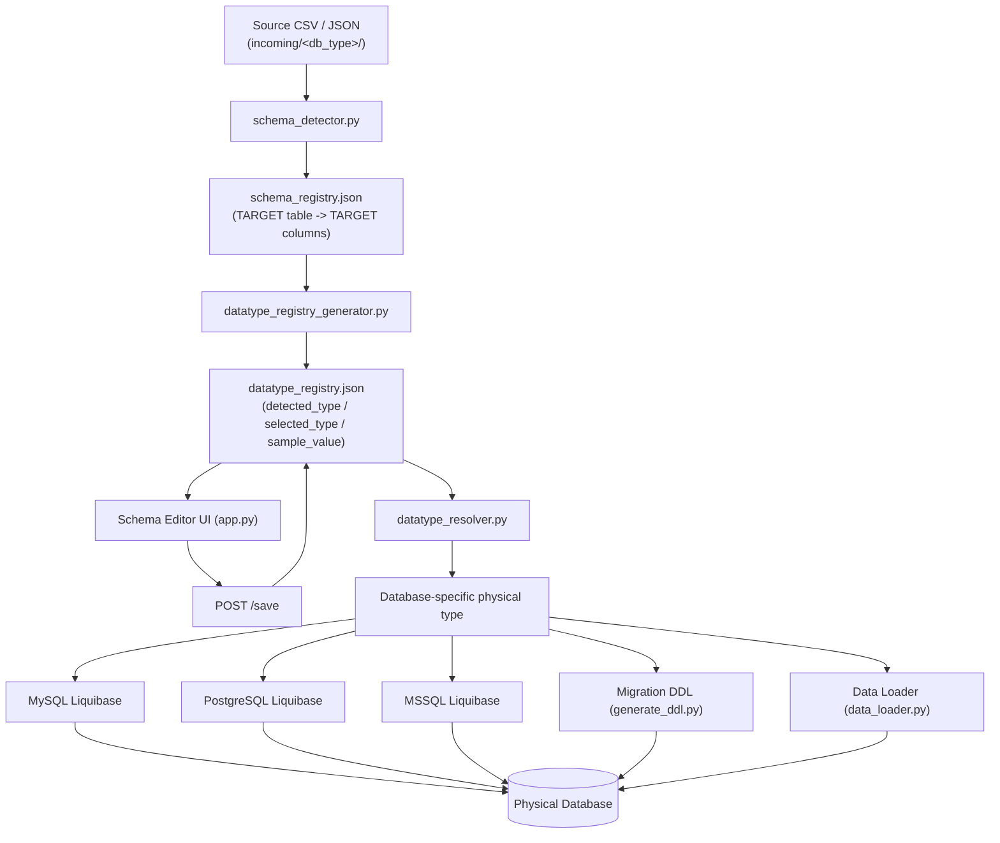
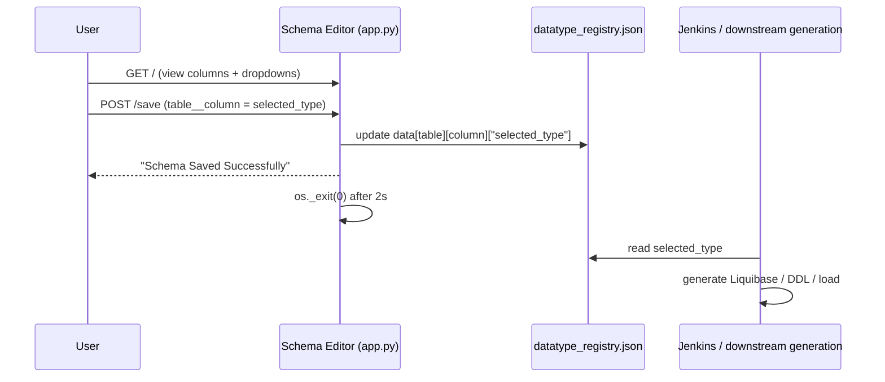
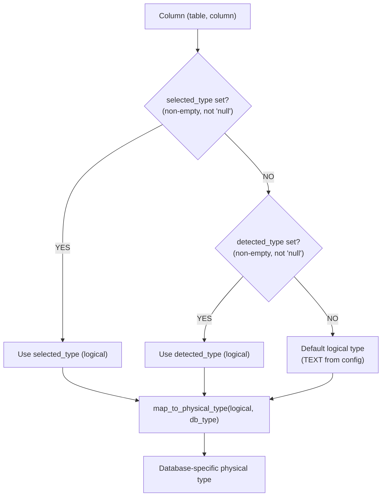
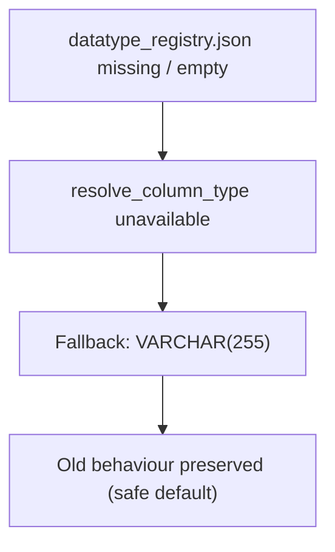
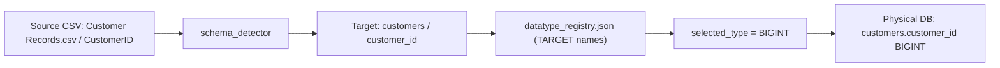

# Runtime Datatype Override

> Documentation set: `runtime_schema_overrides_20260831`
> Branch: `column-name-override`
> Scope of this document: **Runtime Datatype Override / Runtime Datatype Selection only.**
> Column/table name override is covered separately in `COLUMN_NAME_OVERRIDE.md`.

---

## 1. Purpose

Source CSV/JSON files carry raw values with no declarative schema. The pipeline must decide a database
column type for each detected column. This feature provides:

1. **Detection** — `datatype_registry_generator.py` samples source values and proposes an initial
   *logical* `detected_type` (e.g. `INTEGER`, `TEXT`).
2. **User override** — the **Schema Editor** UI lets an operator choose the final `selected_type`
   per column.
3. **Persistence** — the user's choice is written into `metadata/<db_type>/datatype_registry.json`
   under `selected_type`.
4. **Resolution** — `datatype_resolver.py` turns the chosen logical type into a database-specific
   **physical** type using `config/common/datatype_rules.json`.
5. **Propagation** — the resolved physical type flows into Liquibase changelog generation
   (MySQL/PostgreSQL/MSSQL + migration), DDL generation, and the data loader's `CREATE TABLE` /
   `ADD COLUMN` statements.

The key benefit: the operator controls the final datatype without editing any downstream SQL files.


---

## 2. High-Level Flow



Actual function/file references used by this flow (all verified in code):

- `schema_detector.py` → writes `schema_registry.json` (TARGET names).
- `datatype_registry_generator.py:main` → reads `schema_registry.json`, samples source CSV via
  `resolve_source_file_stem` + `get_source_to_target_mapping`, writes `datatype_registry.json`.
- `scripts/schema_editor/app.py` → Flask UI served from `datatype_registry.json`; `POST /save`
  updates `selected_type`.
- `scripts/python/common/datatype_resolver.py` → `resolve_logical_type`, `map_to_physical_type`,
  `resolve_column_type`, `get_column_type`.
- Consumers: `generate_liquibase_xml.py` (mysql/postgresql/mssql), `generate_ddl.py` (migration),
  `data_loader.py`.

---

## 3. `datatype_registry.json`

Produced at `metadata/<db_type>/datatype_registry.json` by `datatype_registry_generator.py`.
Structure (verified against `datatype_registry_generator.py`):

```json
{
  "customers": {
    "customer_id": {
      "detected_type": "INTEGER",
      "selected_type": "BIGINT",
      "sample_value": "1001"
    }
  }
}
```

| Field | Meaning |
|---|---|
| table name (`customers`) | **TARGET** table name (matches `schema_registry.json` keys). |
| column name (`customer_id`) | **TARGET** column name. |
| `detected_type` | Logical type proposed by value sampling (`detect_datatype`). |
| `selected_type` | Logical type chosen by the user (defaults to `detected_type` on first generation). |
| `sample_value` | First sampled non-empty value for the column (display only). |

**Resolution rule** (from `datatype_resolver.resolve_logical_type`):

```
selected_type   (if present, non-empty, and not the literal "null")
    ↓ else
detected_type   (if present, non-empty, and not "null")
    ↓ else
default logical type   (config: settings.default_logical_type = "TEXT")
```

Empty string `""` and the literal `"null"` (case-insensitive) for `selected_type` are treated as
"unset" and fall through to `detected_type`.

---

## 4. Schema Editor / User Flow

The Schema Editor is a Flask app (`scripts/schema_editor/app.py`).

- It reads `metadata/<db_type>/datatype_registry.json` (the `--database` argument selects `<db_type>`).
- `GET /` renders a table of tables/columns with a datatype dropdown per column
  (template `index.html`).
- The user changes a column's datatype and clicks **Save & Continue**.
- `POST /save` iterates `request.form` items. Each field name is `table__column`
  (split on the first `__`); the submitted value is written to
  `data[table][column]["selected_type"]` and persisted back to `datatype_registry.json`.
- After saving, the app returns a "Schema Saved Successfully" page and schedules
  `os._exit(0)` after 2 seconds so the pipeline (e.g. Jenkins) can continue automatically.

The operator never edits the generated Liquibase XML or DDL files by hand; only the
`selected_type` value in `datatype_registry.json` is changed.



### Editor address

`app.py` binds `host="0.0.0.0"` on a port resolved from (in order) the `SCHEMA_EDITOR_PORT`
environment variable, else `config/common/network.conf` `[DEFAULT] SCHEMA_EDITOR_PORT`, default `5000`.
At startup it prints candidate URLs using the detected LAN IP, `127.0.0.1`, and the configured Ubuntu
server IP from `network.conf`. The exact IP is machine-specific and is **not** hardcoded in the
repository, so no fixed URL is documented here.

---

## 5. Logical Types

These are the logical datatypes supported by the resolver (`config/common/datatype_rules.json`,
section `types`). They are database-neutral and selected by detection or by the user:

- `INTEGER`
- `BIGINT`
- `NUMERIC`
- `TEXT`
- `VARCHAR`
- `DATE`
- `TIMESTAMP`
- `BOOLEAN`

Unsupported logical types raise `UnsupportedTypeError` from `map_to_physical_type`. Any logical type
not present in `datatype_rules.json` for the target database is rejected (e.g. a test asserts
`UUID` raises `UnsupportedTypeError`).

---

## 6. Database-Specific Type Mapping

Taken **exactly** from `config/common/datatype_rules.json`:

| Logical Type | MySQL | PostgreSQL | MSSQL |
|---|---|---|---|
| INTEGER | `INT` | `INTEGER` | `INT` |
| BIGINT | `BIGINT` | `BIGINT` | `BIGINT` |
| NUMERIC | `DECIMAL(18,4)` | `NUMERIC` | `DECIMAL(18,4)` |
| TEXT | `TEXT` | `TEXT` | `NVARCHAR(MAX)` |
| VARCHAR | `VARCHAR(255)` | `VARCHAR(255)` | `NVARCHAR(255)` |
| DATE | `DATE` | `DATE` | `DATE` |
| TIMESTAMP | `TIMESTAMP` | `TIMESTAMP` | `DATETIME2` |
| BOOLEAN | `BOOLEAN` | `BOOLEAN` | `BIT` |

**VARCHAR length:** `VARCHAR` maps to `VARCHAR(255)` (MySQL/PostgreSQL) and `NVARCHAR(255)` (MSSQL)
as literal configured mapping values. `settings.default_varchar_length` is `255`, consistent with the
configured mapping; the length is read from the mapping string rather than constructed at runtime.

---

## 7. Resolution Precedence



Functions (verified names in `datatype_resolver.py`):

- `resolve_logical_type(table_name, column_name, registry)` — applies the precedence above and
  returns a logical type.
- `map_to_physical_type(logical_type, db_type)` — maps a logical type to the physical type for a DB.
- `resolve_column_type(table_name, column_name, db_type, registry=None)` — combines the two.
- `get_column_type(registry, table_name, column_name, db_type)` — convenience wrapper.

---

## 8. Downstream Consumers

Every consumer follows the same pattern: load `datatype_registry.json`, call
`resolve_column_type(table, column, db_type, registry)`, and emit the returned physical type.

### MySQL Liquibase — `scripts/python/mysql/setup/generate_liquibase_xml.py`
- Loads `metadata/mysql/datatype_registry.json`.
- `def _get_column_type(...)` returns `resolve_column_type(table, column, "mysql", registry)`,
  or `"VARCHAR(255)"` if the registry is empty / resolution fails.
- Emits `<column name="..." type="..."/>` inside `createTable` / `addColumn` changesets.

### PostgreSQL Liquibase — `scripts/python/postgresql/setup/generate_liquibase_xml.py`
- Same pattern with `db_type="postgresql"`; emits `schemaName="public"` changesets.

### MSSQL Liquibase — `scripts/python/mssql/setup/generate_liquibase_xml.py`
- Same pattern with `db_type="mssql"`.

### Migration DDL — `scripts/python/migration/generate_ddl.py`
- `generate_migration_ddl(dest_db_type)` loads `metadata/<db_type>/datatype_registry.json` and calls
  `resolve_column_type(table, column, dest_db_type.lower(), registry)`.
- Writes to `liquibase/migration/<db_type>/`.

### Data Loader — `scripts/data_loader.py`
- `_load_datatype_registry(db_type)` loads `metadata/<db_type>/datatype_registry.json`
  (returns `{}` if absent).
- `_build_column_types(table_name, column_names, db_type, registry)` calls
  `resolve_column_type(...)` per column; on error falls back to `"VARCHAR(255)"`.
- The resolved types are passed to `create_table` / `add_missing_columns`, replacing the previous
  hardcoded `VARCHAR(255)` behaviour.

> **Behaviour change:** the hardcoded `VARCHAR(255)` column type in the data loader was replaced by
> runtime resolution through `datatype_resolver`, so the user-selected physical type is used for
> `CREATE TABLE` / `ADD COLUMN`. `VARCHAR(255)` now only remains as the *fallback* when no registry
> entry or resolution is available.

---

## 9. Before / After Example

Given `customers.customer_id` with `detected_type=INTEGER`, `selected_type=BIGINT`:

| Database | Physical type |
|---|---|
| MySQL | `BIGINT` |
| PostgreSQL | `BIGINT` |
| MSSQL | `BIGINT` |

Given `first_name` with `selected_type=VARCHAR`:

| Database | Physical type |
|---|---|
| MySQL | `VARCHAR(255)` |
| PostgreSQL | `VARCHAR(255)` |
| MSSQL | `NVARCHAR(255)` |

Given `description` with `selected_type=TEXT`:

| Database | Physical type |
|---|---|
| MySQL | `TEXT` |
| PostgreSQL | `TEXT` |
| MSSQL | `NVARCHAR(MAX)` |

All outcomes above are copied directly from `datatype_rules.json` and confirmed by
`tests/test_datatype_resolver.py` (`test_mysql_mapping`, `test_postgresql_mapping`,
`test_mssql_mapping`) and the Liquibase integration tests.

---

## 10. Real E2E Verification (historical)

> **Status:** The scenario below is reported historical verification. It **cannot be independently
> re-verified from the repository** — no `datatype_e2e_test` database, live run script, or
> committing test exists in the current tree (confirmed by searching the repo). It is recorded here
> for traceability, not as a current passing test.

Reported scenario:

- Database: `datatype_e2e_test` (MySQL).
- Registry:
  - `customers.customer_id`: `detected_type=INTEGER`, `selected_type=BIGINT`
  - `customers.first_name`: `detected_type=TEXT`, `selected_type=VARCHAR`
  - `customers.last_name`: `detected_type=TEXT`, `selected_type=TEXT`
- Reported physical MySQL result:
  - `customer_id` → `bigint`
  - `first_name` → `varchar(255)`
  - `last_name` → `text`
- Reported observations: `selected_type=BIGINT` overrode `detected_type=INTEGER`; target naming
  remained correct; source names did not leak into the physical schema; the isolated database was
  cleaned up.

These reported results are consistent with `datatype_rules.json` (MySQL `BIGINT`, `VARCHAR(255)`,
`TEXT`) and the resolver precedence, but should be treated as historical rather than re-executed.

---

## 11. Bug Fix / Important Implementation Note

During implementation, `data_loader.py` initially confused two distinct concepts:

1. The **type mapping configuration** (`datatype_rules.json` / physical mappings).
2. The **runtime `datatype_registry.json`** containing per-column `detected_type` / `selected_type`.

The data loader was corrected (`_load_datatype_registry` + `_build_column_types`) to load the actual
`metadata/<db_type>/datatype_registry.json` and resolve each column through
`datatype_resolver.resolve_column_type`. This matters because mixing the two sources would have
produced hardcoded types instead of the user's selected types. This is a **fixed** issue, not a current bug.

---

## 12. Missing Registry / Fallback

When `datatype_registry.json` is missing, empty, or lacks an entry for a column:

- `datatype_registry_generator` simply never wrote the entry (or writes `detected_type` = `TEXT`
  when no samples exist).
- Each consumer degrades safely:
  - Liquibase generators: `if not registry: return "VARCHAR(255)"` and `except Exception: return "VARCHAR(255)"`.
  - Migration DDL: same `VARCHAR(255)` fallback.
  - Data loader: `_load_datatype_registry` returns `{}` → `_build_column_types` returns `{}`, and
    `create_table`/`add_missing_columns` use `"VARCHAR(255)"` where a type is missing.



This preserves the previous `VARCHAR(255)` default behaviour when runtime datatype metadata is absent.

---

## 13. Rerun / `selected_type` Preservation

`datatype_registry_generator.py` previously overwrote `selected_type` with `detected_type` on every
rerun. It was fixed to **preserve** an existing user selection.

Current behaviour (`datatype_registry_generator.py:main`):

```python
existing_selected = existing_registry.get(table, {}).get(column, {}).get("selected_type")

if (isinstance(existing_selected, str)
        and existing_selected.strip()
        and existing_selected.strip().lower() != "null"):
    selected = existing_selected.strip()
else:
    selected = detected
```

So:

1. First run: `detected_type=INTEGER` → `selected_type=INTEGER` (no user choice yet).
2. User opens the Schema Editor and sets `selected_type=BIGINT`.
3. Datatype detection reruns: `detected_type` may be recomputed, but because `existing_selected`
   is a valid non-empty string, `selected_type` stays `BIGINT`.

This guarantee ensures operator choices survive schema re-detection.

---

## 14. Backward Compatibility

When no user override exists:

- `selected_type` is empty/equal to `detected_type` (the generator seeds `selected_type = detected`
  on first run).
- Resolution falls through: `selected_type` → `detected_type` → `TEXT`.
- The physical type therefore matches detection, e.g. `detected_type=INTEGER` → MySQL `INT`,
  PostgreSQL `INTEGER`, MSSQL `INT`.

If the datatype registry is unavailable entirely, consumers fall back to `VARCHAR(255)` (§12),
preserving the pre-feature default.

---

## 15. Naming Feature Interaction

The datatype feature operates on **TARGET** names produced by the name-override feature
(`COLUMN_NAME_OVERRIDE.md`). It does not re-read source headers.



Concrete example:

- Source: `Customer Records.csv`, column `CustomerID`.
- Name override → target table `customers`, target column `customer_id`.
- `datatype_registry.json` keyed by `customers.customer_id` with `selected_type=BIGINT`.
- Physical database: `customers.customer_id BIGINT`.

Naming and datatype are **separate concerns**: naming decides the identifier; datatype decides the
column's type. Source names never appear in the physical schema.

---

## 16. Database Coverage

| Database | Consumes `datatype_registry.json` + `datatype_resolver`? |
|---|---|
| MySQL | Yes (`generate_liquibase_xml.py`, `generate_ddl.py`, `data_loader.py`) |
| PostgreSQL | Yes (`generate_liquibase_xml.py`, `generate_ddl.py`, `data_loader.py`) |
| MSSQL | Yes (`generate_liquibase_xml.py`, `generate_ddl.py`, `data_loader.py`) |
| MongoDB | **No** — not part of this SQL datatype override implementation. |

CSV/JSON are **source formats**; MySQL/PostgreSQL/MSSQL are **database consumers**. MongoDB is a
NoSQL target and does not use the SQL physical-type resolver; nothing in the code routes MongoDB
through `datatype_resolver`.

> MongoDB pipelines may still execute the Schema Editor and Datatype Detection stages, but MongoDB is
> not routed through the SQL physical-type resolution performed by `datatype_resolver.py`. The physical
> datatype override described here applies to MySQL, PostgreSQL, and MSSQL.

---

## 17. Testing

Dedicated test suites (all present in `tests/`):

- `tests/test_datatype_resolver.py` — resolver unit tests:
  - MySQL/PostgreSQL/MSSQL logical→physical mapping (`map_to_physical_type`).
  - Precedence: `selected_type` overrides `detected_type`; empty/`null` selected → detected; missing
    both → `TEXT` (`resolve_logical_type`).
  - Case normalization (db type and logical type).
  - Errors: `UnsupportedDatabaseError` (e.g. `mongodb`), `UnsupportedTypeError` (e.g. `UUID`),
    `MissingConfigError`, column/table not found.
  - `resolve_column_type` / `get_column_type` helpers.

- `tests/test_mysql_liquibase_datatypes.py` — MySQL Liquibase integration:
  - `selected_type` override → physical type; missing registry → `VARCHAR(255)`;
    detected-only → physical type; empty selected → detected; `VARCHAR` → `VARCHAR(255)`;
    `addColumn` branch uses resolved types.

- `tests/test_postgresql_liquibase_datatypes.py` — PostgreSQL Liquibase integration:
  - same matrix as MySQL (`selected_type` override, missing registry, detected-only, empty selected,
    `VARCHAR` → `VARCHAR(255)`, `addColumn` branch).

- `tests/test_mssql_liquibase_datatypes.py` — MSSQL Liquibase integration:
  - `selected_type` override, missing registry, detected-only, empty selected,
    `VARCHAR` → `NVARCHAR(255)`, `TIMESTAMP` → `DATETIME2`, `BOOLEAN` → `BIT`,
    multi-column create uses resolved types.

- `tests/test_generate_ddl_datatypes.py` — migration DDL integration (mysql/postgresql/mssql):
  - `selected_type` override, missing registry → `VARCHAR(255)`, detected-only, empty/missing
    selected, `CREATE TABLE` uses resolved type, `ADD COLUMN` uses resolved type.

- `tests/test_data_loader_datatypes.py` — data loader integration:
  - MySQL `BIGINT`, PostgreSQL `INTEGER`, MSSQL `BIT` create; `selected_type` override;
    detected-only; missing registry → `VARCHAR(255)`; `CREATE TABLE`/`ADD COLUMN` use resolved
    types; target names preserved; row insertion unchanged; `load_and_insert_file` uses resolved types.

No explicit test count is claimed here (not re-executed in this read-only task); the coverage listed
above is taken directly from the committed test files.

---

## 18. Operational Configuration

Logical→physical mappings live in `config/common/datatype_rules.json`:

- `settings.default_logical_type` (default `TEXT`) — fallback when neither selected nor detected type
  is available.
- `settings.default_varchar_length` (default `255`) — documented default length.
- `types.<DB>.<LOGICAL>` — the physical type string for each database.

Changing a database-specific physical type (e.g. mapping `VARCHAR` → `VARCHAR(512)`) is a **JSON edit**
to `datatype_rules.json`, provided the new value is a valid physical type for that database. Adding a
wholly new logical type requires adding the key under every supported database block (otherwise
`map_to_physical_type` raises `UnsupportedTypeError`). No resolver code change is needed for value
edits within the existing logical-type set.

---

## 19. Design Guarantees

Verified against code/tests:

- **User-selected datatype is persisted** in `datatype_registry.json` (`selected_type`) via `POST /save`.
- **`selected_type` has precedence over `detected_type`** (`resolve_logical_type`).
- **Selected datatype reaches downstream SQL generation** (Liquibase XML, migration DDL, data loader
  `CREATE TABLE`/`ADD COLUMN`).
- **MySQL/PostgreSQL/MSSQL mappings are database-specific** (`datatype_rules.json`).
- **Data loader uses resolved physical types** (`_build_column_types` + `resolve_column_type`).
- **Missing metadata has a safe fallback** to `VARCHAR(255)`.
- **Existing `selected_type` survives datatype-registry regeneration** (preservation logic in
  `datatype_registry_generator.py`).
- **Naming and datatype concerns remain separated** (datatype works on TARGET names only).
- **MongoDB is outside this SQL datatype override path** (no resolver routing).

---

*End of document — Runtime Datatype Override.*
