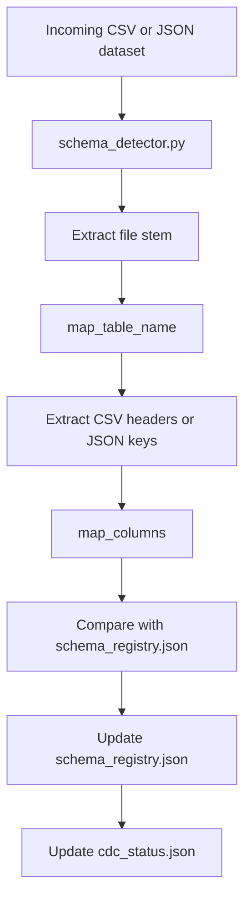

# Column Mapping Documentation

## 1. Purpose

Column Mapping provides one consistent naming convention for source datasets whose table and column names differ in spelling, punctuation, case, or abbreviations. It prevents source-specific names such as `CustID`, `First Name`, and `Phone#` from creating inconsistent schema metadata.

Schema standardization is required because the schema registry, downstream loaders, CDC metadata, and database-specific pipelines need stable identifiers. The feature is shared: a source name is mapped before schema comparison and persistence, regardless of the target database.

## 2. Feature Overview

The load pipeline invokes the common schema detector with a database argument. The detector scans that database's incoming folder, maps the file stem and field names, compares the result with stored metadata, and writes schema and CDC metadata.



## 3. Architecture

| File | Responsibility |
|---|---|
| `scripts/schema_detector.py` | Scans CSV and JSON files; calls table/column mapping; compares schemas; writes `schema_registry.json` and `cdc_status.json`; emits readable processing, mapping, comparison, and summary logs. |
| `scripts/python/common/column_mapper.py` | Locates and reads `config/column_mapping.json`; normalizes a source name; applies manual then dictionary mappings; logs each mapping; returns the mapped name. `map_table_name()` uses the same mapping function. |
| `config/column_mapping.json` | Supplies the mapping configuration. Only `manual` and `dictionary` are consumed by the current `column_mapper.py` implementation. |

### Configuration sections

| Section | Current role | Example |
|---|---|---|
| `settings` | Present in configuration, but not read by the current mapper. | `"normalize_columns": true` does not independently toggle mapper behavior. |
| `replace` | Present in configuration, but not read by the current mapper. The mapper has built-in regex normalization instead. | The built-in normalizer maps `First Name` to `first_name`. |
| `manual` | Active. Highest-priority mapping after normalization. Keys are normalized before lookup. | `"CustID": "customer_id"` maps `CustID` to `customer_id`. |
| `dictionary` | Active. Used when no manual mapping exists. | `"phone": "phone_no"` maps `Phone` to `phone_no`. |
| `ignore_columns` | Present in configuration, but not read by the current mapper or schema detector. | `"unnamed"` is not automatically removed. |
| `table_mapping` | Present in configuration, but not read by the current mapper. Table names use the same manual/dictionary/normalization logic as columns. | `Customer Data` currently normalizes to `customer_data`, not `customers`, unless an active manual/dictionary mapping matches it. |

## 4. Processing Flow

### CSV

For `Customer Data.csv` with headers `CustID`, `First Name`, `DOB`, and `Phone#`:

| Stage | Result |
|---|---|
| File stem | `Customer Data` |
| Current table mapping result | `customer_data` |
| `CustID` | `customer_id` (manual mapping) |
| `First Name` | `first_name` (built-in normalization) |
| `DOB` | `date_of_birth` (manual mapping; manual takes precedence over dictionary) |
| `Phone#` | `phone_no` (built-in normalization produces `phone`, then the dictionary mapping applies) |

The mapped table name and mapped column list are compared with the existing entry in `metadata/<database>/schema_registry.json`. The registry is then updated, and the per-table comparison result is written to `metadata/<database>/cdc_status.json`.

### JSON

For a JSON object, the detector uses the object's keys. For a JSON array, it uses the keys of the first object. It runs those keys through the same `map_columns()` function used for CSV headers. Empty arrays, empty objects, and unsupported top-level JSON values produce no keys; the detector logs a warning and skips that file safely.

## 5. Mapping Priority

The current executable order is:

1. Trim leading and trailing whitespace.
2. Convert to lowercase.
3. Replace each contiguous run of non-`a-z`/`0-9` characters with one underscore.
4. Remove leading and trailing underscores.
5. Apply an active `manual` mapping, if present.
6. Otherwise apply an active `dictionary` mapping, if present.
7. Otherwise keep the normalized value.

This order gives explicit manual mappings control over shared dictionary entries, while producing deterministic normalized names for all unmapped inputs. Duplicate underscores are inherently collapsed when they are part of the same non-alphanumeric character run.

The current implementation does **not** separately execute configurable character replacements, a configurable camel-case split, or a configuration-controlled mapping switch. For example, `FirstName` becomes `firstname`, not `first_name`, unless a manual or dictionary entry covers it.

## 6. Logging

`schema_detector.py` logs the following sections:

| Log section | Meaning |
|---|---|
| `Processing File` | Source filename, mapped table name, and number of fields found. |
| `Column Mapping` | Each source header/key and its mapped destination name. |
| `Schema Comparison` | Whether the table is new, changed, deleted, or unchanged, with added/deleted columns where applicable. |
| `Schema Registry Updated Successfully.` | Confirmation after a mapped schema is persisted. |
| `COLUMN MAPPING SUMMARY` | File and field totals plus schema-status totals for the run. |

Example:

```text
Processing File : Customer Data.csv
Table Name      : customer_data
Columns Found   : 4

Column Mapping
------------------------------------------
CustID          -> customer_id
First Name      -> first_name
DOB             -> date_of_birth
Phone#          -> phone_no
------------------------------------------
Schema Status : NEW
Schema Registry Updated Successfully.
```

## 7. Configuration Guide

The active configuration is `config/column_mapping.json`; developers can change active manual and dictionary mappings without editing Python.

| Need | Active configuration change |
|---|---|
| Add an abbreviation | Add a normalized source key to `dictionary`, for example `"tel": "phone_no"`. |
| Override a standard rule | Add a key to `manual`; manual has priority over `dictionary`. |
| Map a table to a non-normalized target | Add an equivalent entry to active `manual` or `dictionary`, because `table_mapping` is not currently consumed. |
| Change replacements, ignore columns, or settings | These sections are currently descriptive only; changing them alone does not alter runtime behavior. |

Configuration is loaded once per Python process and cached. Restart or invoke a new schema-detector process after changing the JSON file.

## 8. Cross Platform Support

The feature is portable across Windows and Ubuntu because `schema_detector.py` constructs its common-module location with:

```python
Path(__file__).resolve().parent / "python" / "common"
```

`pathlib.Path` selects the native path representation for the host OS. The resolved directory is inserted into `sys.path` before `column_mapper` is imported. The mapping and schema logic do not branch on operating system, and they contain no Windows-only business path or command.

## 9. Database Support

Column Mapping is database-independent. `schema_detector.py` is the shared implementation for:

- PostgreSQL
- MySQL
- MongoDB
- Microsoft SQL Server (MSSQL)

The database argument only selects `incoming/<database>` and `metadata/<database>` locations. Table and column mapping are executed by the same `map_table_name()` and `map_columns()` calls for every supported database.

## 10. Jenkins Pipeline Integration


Windows pipelines call database batch load/deploy scripts, which invoke `python scripts\\schema_detector.py <database>`. Ubuntu pipelines call Bash load scripts, which invoke `python3 scripts/schema_detector.py <database>`. Both execute the same Python file and mapping implementation.

## 11. Edge Cases Handled

| Input or condition | Current behavior |
|---|---|
| CSV files | Reads the first row as headers using UTF-8 with BOM handling. |
| JSON files | Reads object keys or keys from the first array object. |
| Empty JSON / no JSON keys | Logs a warning and skips the file safely. |
| Whitespace and special characters | Normalizes them through the built-in regex. |
| Snake case | Retained in normalized form. |
| Duplicate mapped destinations | Retained in the output list; `column_mapper` logs a warning. |
| Manual override | Applied before dictionary mapping. |
| Dictionary mapping | Applied after manual mapping and before fallback normalization. |
| Blank CSV headers | Normalize to an empty string; they are not automatically ignored. |
| Configured ignored columns | Not currently filtered. |

## 12. Future Extension

New active manual and dictionary rules can be added in `config/column_mapping.json` without changing Python code. Future maintainers should validate new rules against representative CSV and JSON headers and restart the schema-detector process so the cached configuration is reloaded.

## 13. Limitations

- Only `manual` and `dictionary` are read from `column_mapping.json` today. `settings`, `replace`, `ignore_columns`, and `table_mapping` do not alter runtime behavior.
- Normalization does not split camel case. `FirstName` becomes `firstname` unless configured in an active mapping.
- Blank headers and configured ignored columns are not removed automatically.
- Duplicate destination names are logged but are not deduplicated by `map_columns()`.

## 14. Testing Performed

The following static verification has been completed for the current implementation:

| Check | Status |
|---|---|
| Windows pipeline trace | ✓ PostgreSQL, MySQL, MongoDB, MSSQL reach the common schema detector. |
| Ubuntu pipeline trace | ✓ PostgreSQL, MySQL, MongoDB, MSSQL reach the common schema detector. |
| CSV path | ✓ Uses table and column mapping before registry update. |
| JSON path | ✓ Uses the same mapping flow; no-key JSON is skipped. |
| Jenkins and CI/CD Groovy files | ✓ Windows and Ubuntu load pipeline definitions reviewed. |
| Common import path | ✓ `COMMON_MODULE_DIR`, `Path(__file__).resolve()`, and `column_mapper` import reviewed. |
| Shared detector | ✓ One database-independent `schema_detector.py` is used. |

This is static verification of source and pipeline wiring, not a replacement for a runtime integration test with database services and representative datasets.

## 15. Summary

Column Mapping standardizes dataset table names and fields before schema state is compared or persisted. Every supported Windows and Ubuntu load path reaches the common `schema_detector.py`, which imports the shared `column_mapper.py` through a platform-neutral `pathlib` path.

The runtime mapper normalizes a source name, applies manual mappings first, then dictionary mappings, and otherwise keeps the normalized name. The resulting schema is stored in the database-specific registry and reflected in CDC metadata. This makes the feature consistent across PostgreSQL, MySQL, MongoDB, and MSSQL while keeping active mapping-rule changes in JSON configuration.
